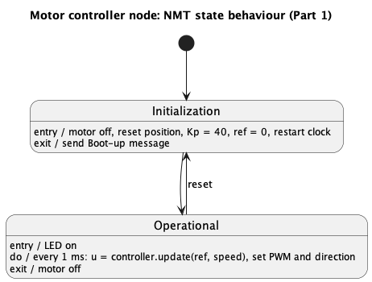
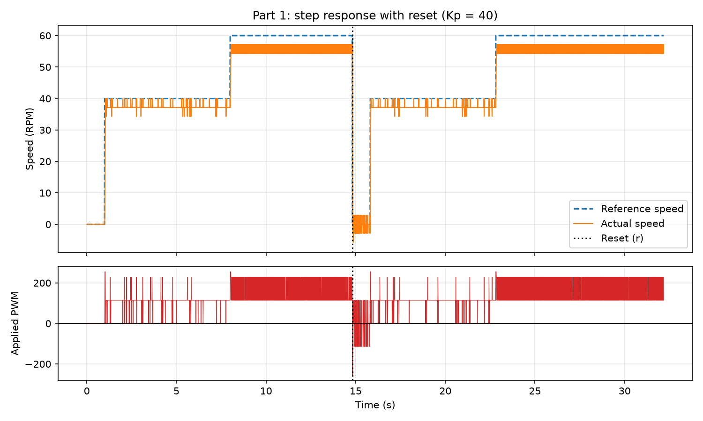
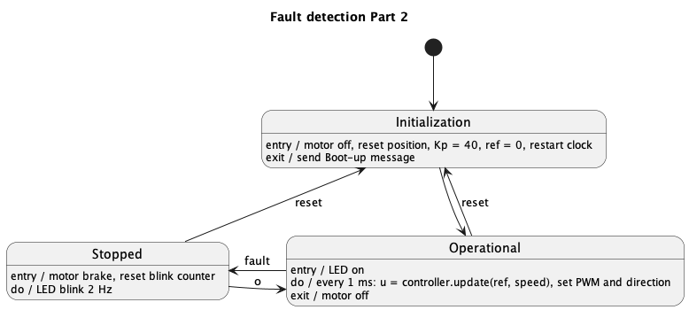
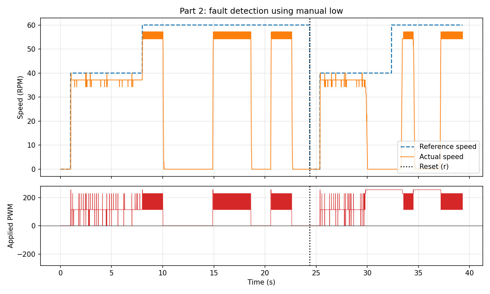

# Project 3 - Results

## Part 1

### State diagram
The device starts in Initialization, which resets the motor controller and then moves on to Operational by itself (completion transition, no trigger). The reset command takes it from Operational back to Initialization.

- Initialization, entry: motor off, position reset, $K_p = 40$, $ref = 0$, clock restarted.
- Initialization, exit: the Boot-up message is sent, since the device is now ready to receive commands.
- Operational, entry: LED on. Do: one control update every 1ms. Exit: motor off.

### Resource allocation
Same wiring as Project 2 (encoder on D3/D4, AIN1 on D8, AIN2 on D9). What changed:

| Resource | Use in Project 3 | Notes |
|---|---|---|
| D13 (PB5), onboard LED | Status LED, owned by the states | Was toggled by the encoder ISR in Project 2, removed from `Encoder` so the states are the only ones writing to it |
| Timer1 COMPA interrupt (1ms) | Samples speed and sets a `control_tick` flag | The control update is moved out of the ISR and into `Operational::on_step()` |
| USART0 RX | Keyboard commands from the laptop | `r` = reset, read in `main()` with `Serial.available()`/`Serial.read()` |
| USART0 TX | Boot-up message and the CSV log every 10ms | Same as Project 2, 115200 baud |

Memory (from the PlatformIO build output), before and after linking in the state machine:

| | RAM | Flash |
|---|---|---|
| Before | 290 B | 4582 B |
| After | 332 B | 5038 B |

So the state machine costs 42 B of RAM and 456 B of Flash. Most of the RAM increase is the vtables, since avr-gcc puts them in SRAM and not in Flash.

### Implementation (state behaviour pattern)
The state machine follows the state pattern from L3.1, using the same names.

**`State` (base class, `state.h`)**
- Holds a `Context* context_` pointer back to the state machine, so a state can trigger its own transitions.
- Declares `on_entry()`, `on_exit()`, `on_step()` and `on_reset()` as `virtual` with empty bodies. A state only overrides the handlers it needs, so an event that isn't in the diagram for that state is ignored by default (e.g. `reset` in Initialization).

**`Context` (`context.h/.cpp`)**
- Holds a `State* state_` pointer to the current state.
- `transition_to(next)`: runs `on_exit()` of the old state, switches the pointer, gives the new state its `context_` pointer and runs `on_entry()` of the new state. `on_entry()` is last so a new transition from inside an entry action doesn't get overwritten.
- `step()` and `reset()` just forward to the current state (`state_->on_step()`, `state_->on_reset()`). Since the handlers are virtual, the version of the actual state is called, so `Context` never has to check which state it's in.
- `start()` enters the initial state. It is called from `main()` after all hardware init, since a global object is constructed before `main()` runs and the pins wouldn't be set up yet.
- `on_step()` implements the `do` activity from the diagram, `step()` is called once per 1ms tick.

**Concrete states (`nmt_states.h/.cpp`)**
- `Initialization` and `Operational` inherit from `State` and override the handlers from the diagram, one to one.
- The states are static global objects instead of `new Concrete_state` as in the lecture example. With only 2kB RAM we don't want the heap, and this way the memory use is known at compile time.
- The Init ==> Operational transition is done in `Initialization::on_step()`, so it happens on the first tick. Doing it inside `on_entry()` would call `transition_to()` from inside `transition_to()`.

**Changes to `Encoder`**
- `stop_motor()`: sets `dir_pin` low and the PWM to 0. Both pins have to be low, with `dir_pin` high and PWM 0 the H-bridge would drive the motor at full speed in reverse.
- `reset_position()`: sets `pos` to 0 and also clears the 10ms sliding window. Otherwise the next 10 speed samples would be computed as $0 - p_{old}$, a large fake negative speed that the controller would react to.

**Control loop timing**
- The Timer1 ISR still calls `sample_speed()` every 1ms, since the speed calculation needs a fixed $\Delta t$ (same as Project 2). It then sets `control_tick = true`.
- `main()` checks the flag, clears it and calls `context.step()`. In Operational this runs the P controller and sets PWM and direction, so $f_{update}$ is still 1kHz.
- This way the state decides if a control update should run at all. In Initialization no control update is done, with the control in the ISR it would always run.
- `control_tick` is `volatile` since it is changed by the ISR and polled in `main()`.

**Reset command and test profile**
- `main()` reads one character at a time from serial, `r` calls `context.reset()`. Only `Operational` overrides `on_reset()`, which calls `transition_to(&initialization)`.
- For testing, `main()` sets the reference from the time since the last (re)boot: $0$ RPM until 1s, $40$ RPM until 8s, then $60$ RPM. Since Initialization restarts the clock, the same step sequence is run again after every reset.

### Test
The motor ran the step sequence, `r` was pressed at steady state at 60 RPM (~14.8s) and the step sequence was run again. The serial output was saved with the `log2file` monitor filter. Since `time_ms` restarts from 0 on reset, the plot adds an offset after each Boot-up line so the time axis is continuous.

- Boot-up is printed at power-on and again right after `r`, and `time_ms` restarts from 8ms ==> the device went Operational ==> Initialization ==> Operational.
- After the reset the speed goes from 57 RPM to ~0 in ~70ms. `stop_motor()` only acts for the 1ms spent in Initialization, after that Operational runs with $ref = 0$, so the controller brakes the motor with reverse voltage ($u = 40 \cdot (0 - 34.3) = -1371$, clamped to $-255$).
- At standstill the speed switches between $0$ and $\pm 2.86$ RPM, which is one encoder count in the 10ms window (the speed resolution from Project 2).
- After the new step to 40 RPM the speed reaches ~37 RPM in ~30ms, same as before the reset.
- The LED stayed on during the whole run.
- Serial print interval: $10ms \pm 1ms$, no gaps, so the main loop never blocked.

### Interpretation
The state machine behaves as the diagram: Initialization runs once at boot and after every reset, and the device ends up in Operational by itself. The control behaviour is the same as in Project 2, the speed settles at ~37 RPM for 40 RPM and ~54-57 RPM for 60 RPM. This is the steady-state error of a P controller, which the PI controller in Part 3 should remove.

## Part 2

### State diagram
The Stopped state is added. A fault detected in Operational moves the device to Stopped, where the motor is braked and the LED blinks at 2 Hz. From Stopped, `o` (set operational) goes back to Operational and `r` (reset) goes to Initialization. A fault in Stopped is ignored, since the device is already stopped.

- Stopped, entry: motor brake (both H-bridge inputs high), blink counter reset.
- Stopped, do: LED blink at 2 Hz.
- Operational ==> Stopped on `fault`, which is the FLT pin being low.

### Resource allocation
| Resource | Use in Part 2 | Notes |
|---|---|---|
| D2 (PD2), FLT pin of the motor driver | Fault input, `Digital_in` with internal pull-up | FLT is open-drain and active low, so the pull-up keeps it high while there is no fault |
| D13 (PB5), onboard LED | Toggled every 250 ms in Stopped | Gives a 2 Hz blink |
| USART0 RX | `o` added as a command | `r` = reset, `o` = set operational |

Memory (PlatformIO build output) for the finished Part 2: 363 B RAM, 5342 B Flash.

### Implementation
**Fault detection**
- `Encoder::has_fault()` returns `flt.is_lo()`. The fault pin was added to the `Encoder` class since it already owns the motor driver pins.
- `main()` polls `enc.has_fault()` on every loop iteration and calls `context.fault()` while it is low. The main loop runs much faster than the 1 ms control tick, so the fault is picked up within one tick.
- Since the fault is polled as a level and not an edge, a fault that is still present is not lost: if `o` is pressed while FLT is still low, the device goes to Operational and immediately back to Stopped on the next loop iteration.

**State behaviour**
- `State` gets two new virtual handlers, `on_fault()` and `on_set_operational()`, with empty default bodies. Only the states where the event is in the diagram override them, the others ignore the event by default (e.g. `fault` in Stopped or Initialization, `o` in Operational).
- `Operational::on_fault()` calls `transition_to(&stopped)`. The exit action of Operational (motor off) runs first, then the entry action of Stopped (brake).
- `Stopped::on_entry()` calls `enc.brake()`, which sets both H-bridge inputs high (`dir_pin` high, PWM 255). This shorts the motor terminals through the bridge, so the motor is actively braked instead of coasting as with `stop_motor()`.
- `Stopped::on_step()` toggles the LED every 250 ticks (250 ms), so a 2 Hz blink.
- `Stopped::on_reset()` goes to Initialization and `Stopped::on_set_operational()` goes to Operational.

### Test
The FLT input was pulled low by hand with a wire to GND, as an "emergency stop" button. The motor ran the same step profile as in Part 1 (0 RPM until 1 s, 40 RPM until 8 s, then 60 RPM).

- Three faults were triggered at ~10.0 s, ~18.6 s and ~22.6 s while running at ~57 RPM. Each time the PWM went to 0 and the motor was braked from ~55-57 RPM to standstill in 90-100 ms.
- `o` was pressed at ~14.9 s and ~20.6 s, and the motor went back to Operational and to the reference again.
- `r` was pressed at ~24.4 s (dotted line). Boot-up was printed again and the step profile restarted from 0.
- The LED was on in Operational and blinked at 2 Hz in Stopped (seen on the board, not in the log).
- After the reset, the motor was held stationary by hand at ~29.8-33.5 s and ~34.5-37.2 s to try to cause an over-current fault. The controller saturated at PWM 255 with the speed at 0, but the FLT pin never went low, so no fault was triggered. This matches the note in the assignment that the fault pin may not give a repeatable fault depending on the power supply, which is why the manual wire was used to test the fault path.

### Interpretation
The fault path works as in the diagram: a low FLT moves the device from Operational to Stopped, the motor is braked within ~100 ms, and both `o` and `r` work from Stopped. The over-current fault from the driver itself could not be triggered with our power supply, so the fault detection was tested with the manual emergency stop input instead.
