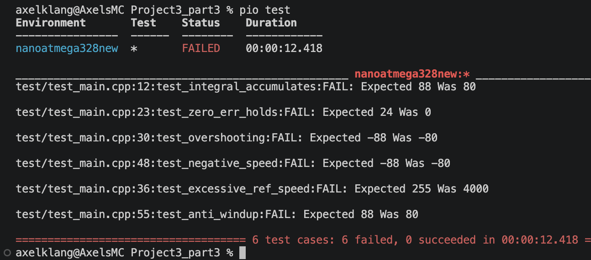
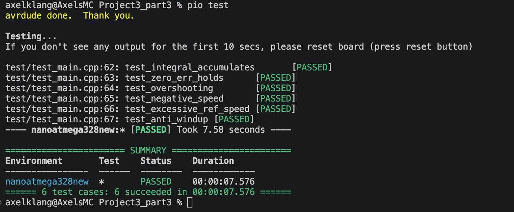
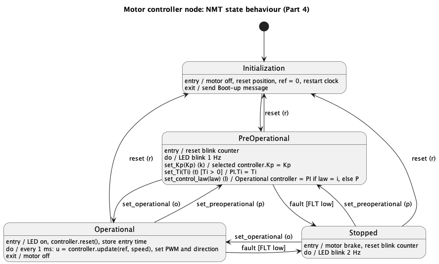
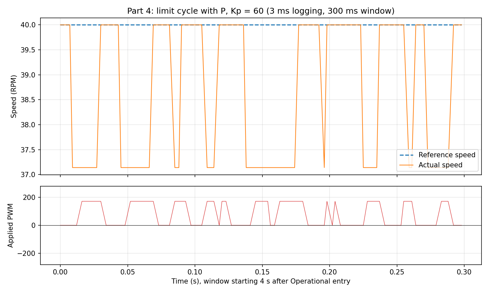
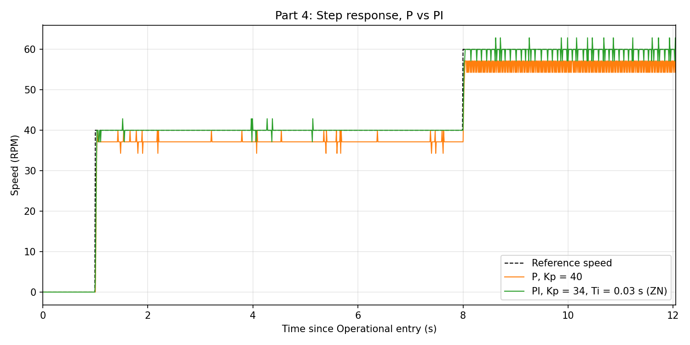
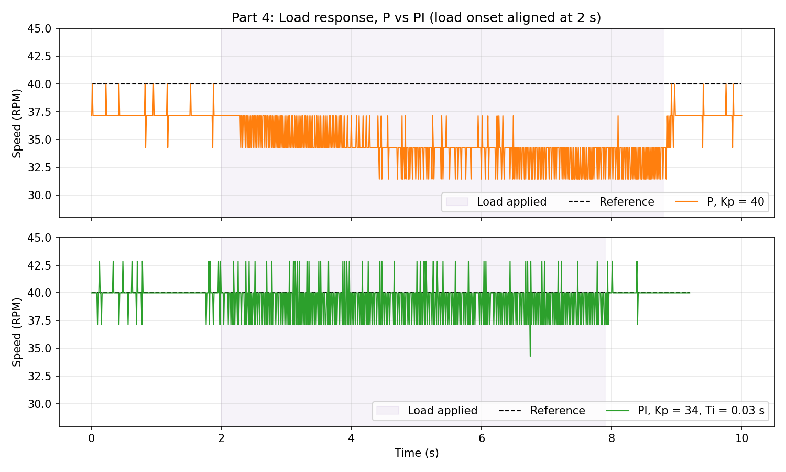
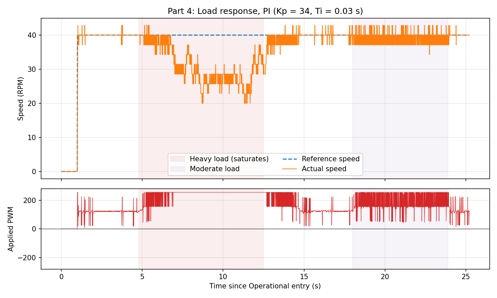

# Project 3 - Results, Part 3 and 4

Parts 1 and 2 (Initialization, Operational, reset, Stopped and fault detection) are in `../Project3/results_P3.md`. This folder continues from that code and adds the PI controller (Part 3) and the Pre-operational state with controller configuration (Part 4).

Video: https://www.youtube.com/shorts/drDhP2g1Hc4

## Part 3

### Design: controller classes with polymorphism
The controllers are moved into their own library, `lib/controllers/`. PlatformIO does not compile `src/` when building the unit tests, so code that the tests need has to be in `lib/`. The firmware picks it up from there as well.

**`Controller` (abstract base class, `controller.h`)**
- `virtual double update(double ref, double actual) = 0;` and `virtual void reset() = 0;`, both pure virtual, so `Controller` itself can't be instantiated and every controller has to implement both.
- Public parameters `Kp` and `Ti`, set through the constructor `Controller(Kp, Ti)`.

**`P_controller` (`controllers.h/.cpp`)**
- Constructor `P_controller(Kp)`, Ti is not used.
- `update()` returns $K_p \cdot e$ with $e = ref - actual$, same control law as Project 2.
- `reset()` does nothing, there is no internal state.

**`PI_controller` (`controllers.h/.cpp`)**
- Constructor `PI_controller(Kp, Ti, dt)`. `dt` is the time step of the control loop, 1 ms in the firmware.
- Private state `E`, the time integral of the error.
- `reset()` sets `E = 0`. It is called on entry to Operational, so a new run never starts with an old integral.

The code that uses a controller only holds a `Controller*` and calls `update()` and `reset()` through it. Since the functions are virtual, the version of the actual object is called, so the P and PI controllers can be swapped without changing the calling code (see Part 4).

Firmware instances (`controllers.cpp`): `P_controller p(40);` and `PI_controller pi(40, 0.1, 0.001);`. Kp = 40 is the best P gain found in Project 2.

### PI control law with anti-windup
The control law is

$$u = K_p \left(e + \frac{1}{T_i} E\right), \qquad E_k = E_{k-1} + e_k \, \Delta t$$

```cpp
double PI_controller::update(double ref, double actual) {
    double e = ref - actual;
    double E_new = E + e * dt;
    double u = Kp * (e + E_new / Ti);

    if (u > 255) return 255;
    if (u < -255) return -255;

    E = E_new;
    return u;
}
```

Anti-windup is done by conditional integration: the new integral `E_new` is computed first, and it is only stored if the output is not saturated. If $|u| > 255$ the output is clamped to ±255 and `E` keeps its old value. So while the motor can't follow the reference (the PWM is already at 100%), the integral stops growing, and when the load or reference allows it again the controller responds right away instead of first having to unwind a large integral.

The sign of $u$ gives the direction (see Part 4), so the PI controller is clamped symmetrically to ±255.

### Normal and alternate flows, test cases
| # | Flow | Situation | Expected behaviour | Test |
|---|---|---|---|---|
| 1 | Normal | Constant positive error | Output grows each step as the integral accumulates | `test_integral_accumulates` |
| 2 | Normal | Error goes to zero after accumulating | Output is held by the integral, not reset to 0 (this is what removes the steady-state error) | `test_zero_err_holds` |
| 3 | Alternate | Overshoot, actual > ref | Negative output, so reverse voltage is applied | `test_overshooting` |
| 4 | Alternate | Negative reference | Negative output, motor driven in reverse | `test_negative_speed` |
| 5 | Alternate | Reference beyond what the motor can do | Output clamped to +255 / -255 | `test_excessive_ref_speed` |
| 6 | Alternate | Long saturation, then a reachable reference | Integral did not wind up, so the output is the same as from a fresh start | `test_anti_windup` |

The tests use their own instance `PI_controller ctrl(40, 1, 0.1)`, so $K_p = 40$ and $\Delta t / T_i = 0.1$, which makes the expected values easy to compute by hand. The test instance is separate from the firmware instance, so the tests don't depend on the values used on the motor.

| Test | Calls | Expected | Derivation |
|---|---|---|---|
| `test_integral_accumulates` | `update(2, 0)` three times | 88, 96, 104 | $E/T_i$ = 0.2, 0.4, 0.6, $u = 40 (2 + E/T_i)$ |
| `test_zero_err_holds` | three × `update(2, 0)`, then `update(3, 3)` twice | 24, 24 | $e = 0$, $u = 40 \cdot 0.6 = 24$, the integral doesn't change |
| `test_overshooting` | `update(5, 7)` | -88 | $e = -2$, $u = 40(-2 - 0.2)$ |
| `test_negative_speed` | `update(-2, 0)` | -88 | Same as above with negative ref |
| `test_excessive_ref_speed` | three × `update(100, 0)`, three × `update(-100, 0)` | 255 ×3, -255 ×3 | $u = 40(100 + 10) = 4400$, clamped |
| `test_anti_windup` | 100 × `update(100, 0)`, then `update(2, 0)` | 88 | Only true if `E` stayed 0 during saturation, with windup `E` would be 1000 |

Each test calls `ctrl.reset()` at the end so the tests are independent.

### TDD: test output before and after
The tests run on the Arduino Nano with Unity (`pio test`).

Before: the tests run against the existing `P_controller(40)` through the same `Controller` interface, i.e. without the integral term and without saturation. All 6 tests fail, and the failures show exactly what is missing: 80 instead of 88 (no integral), 0 instead of 24 (no integral to hold the output), 4000 instead of 255 (no clamp).



After: the same tests against `PI_controller` with the control law and anti-windup above. All 6 tests pass.



### Memory
| | RAM | Flash |
|---|---|---|
| End of Part 2 | 363 B | 5342 B |
| End of Part 4 | 540 B | 9162 B |

Most of the Flash increase comes from Part 4: `String`, `readStringUntil()` and `toDouble()` for parsing the parameter commands, plus the floating point code of the PI controller.

## Part 4

### State diagram
The Pre-operational state is added between Initialization and Operational. After Boot-up, the device now goes to Pre-operational and waits for configuration, instead of starting the motor directly.



- Initialization ==> Pre-operational is a completion transition (no trigger), done on the first tick.
- Pre-operational: LED blinks at 1 Hz. The configuration commands are internal transitions: they run an action but stay in the state, so entry/exit actions are not run.
- Pre-operational ==> Operational on `o`, ==> Initialization on `r`, ==> Stopped on fault.
- Operational ==> Pre-operational on `p`. Stopped accepts `r`, `o` and `p`, as in the NMT state machine.
- Operational, entry: LED on, `controller.reset()` (clears the integral), stores the entry time for the test profile.

### Commands
Commands are typed in the serial monitor. The ones with a value are ended with Enter.

| Command | Event | Accepted in | Action |
|---|---|---|---|
| `r` | reset | Pre-op, Operational, Stopped | ==> Initialization |
| `o` | set operational | Pre-op, Stopped | ==> Operational |
| `p` | set pre-operational | Operational, Stopped | ==> Pre-operational |
| `k<value>` | set Kp | Pre-op | Kp of the selected controller, e.g. `k34` |
| `t<value>` | set Ti | Pre-op | Ti of the PI controller, only if Ti > 0, e.g. `t0.03` |
| `l<i/p>` | set control law | Pre-op | `li` selects PI, `lp` (any other letter) selects P |

- `main()` reads one character, and for `k`, `t` and `l` reads the rest of the line with `Serial.readStringUntil('\n')`. The value is converted with `toDouble()` and passed to the context, e.g. `context.set_Kp(kp)`.
- The Context forwards each command to the current state. Only `PreOperational` overrides `on_set_Kp()`, `on_set_Ti()` and `on_set_control_law()`, so parameter commands are ignored in every other state. The controller can't be changed while it is running the motor.
- Kp goes to the selected controller, so P and PI keep their own tuning. Ti always goes to the PI controller, since the P controller doesn't use it, so the order of `t` and `l` doesn't matter.
- The `Ti > 0` check is a guard, since $T_i = 0$ would divide by zero.
- Every parameter command prints a confirmation, e.g. `PI Kp set to 34.00` or `Control law: P`, so the configuration is visible in the log. The plot script skips these lines.
- The parameters are kept over a reset, so a tuning doesn't have to be typed in again after `r`. This was a design choice.

### Controller passed as an argument
The controller is passed to the motor controller (`Operational`) instead of being a global that `Operational` reads:

```cpp
class Operational : public State {
    public:
        Operational(Controller* controller) : controller_(controller) {}
        void set_controller(Controller* controller) { controller_ = controller; }
        Controller* get_controller() { return controller_; }
        ...
    private:
        Controller* controller_;
};

Operational operational(&pi);   // PI by default at boot
```

- `Operational::on_step()` calls `controller_->update(ref, speed)` and `on_entry()` calls `controller_->reset()`. Operational never knows whether it runs P or PI.
- `PreOperational::on_set_control_law()` calls `operational.set_controller(&pi)` or `operational.set_controller(&p)`. This is where the polymorphism from Part 3 is used: both are passed as a `Controller*`.

### Direction from the sign of u
- $u \geq 0$: `dir_pin` low, PWM $= u$, so forward.
- $u < 0$: `dir_pin` high, PWM $= 255 - |u|$, so reverse. With one input high, the motor voltage is set by the time the PWM pin is low, which is why the duty is inverted.
- `Analog_out::set()` clamps the PWM to 0-255, so a large P output saturates at full forward or full reverse.

### Test profile
For the tests, `main()` sets the reference from the time since entering Operational (`operational.entry_ms`), not since boot. So the time spent typing commands in Pre-operational doesn't move the step, and `p` then `o` runs the profile again.
- Step test: 0 RPM until 1 s, 40 RPM until 8 s, then 60 RPM.
- Load test: 0 RPM until 1 s, then 40 RPM (the code in the repo has this profile, the step profile is described in a comment).

The reference also follows the profile while in Pre-operational, but there the motor isn't driven, so it has no effect. The plots are cropped to start at Operational entry.

### Tuning with Ziegler-Nichols
**Classic ZN (ultimate gain) did not give a clean oscillation.** With the P controller and increasing Kp, the speed doesn't start a sinusoidal oscillation. Instead it chatters between two neighbouring encoder values. The speed resolution is one encoder count in the 10 ms window, 2.86 RPM. At Kp = 40-60, one count of error already gives 114-171 PWM, so the controller works more like a relay (on/off) than a linear gain, and the loop ends in a limit cycle set by the quantisation.

**Relay method (Åström-Hägglund).** A relay in the loop gives a limit cycle, and from its amplitude and period the ultimate gain and period can be estimated:

$$K_u \approx \frac{4d}{\pi a}$$

with $d$ the half-amplitude of the controller output and $a$ the half-amplitude of the oscillation. The rest is standard ZN for a PI: $K_p = 0.45 K_u$, $T_i = T_u / 1.2$.

**Measurement.** P controller, Kp = 60, reference 40 RPM. The first log at the normal 10 ms print interval gave a period of exactly 20 ms, which is two samples, so it was aliased. The print interval was set to 3 ms for this run only (`logs/part4_chatter_Kp60_3ms.csv`). At 3 ms the timestamps jitter between 2 and 4 ms because the serial output starts to delay the main loop, which is why all other runs use 10 ms.



- The speed alternates between exactly 37.14 and 40.00 RPM (one count) and the PWM between 0 and 171.4 ($= 60 \cdot 2.857$, one count of error).
- $d = 171.4 / 2 = 85.7$, $a = 2.86 / 2 = 1.43$ RPM.
- $T_u$: median period 33 ms. The period is not regular, most periods are 21-39 ms, which fits a limit cycle driven by quantisation and not by the motor dynamics alone.

| | Value |
|---|---|
| $K_u = 4d / (\pi a)$ | ≈ 76 |
| $T_u$ | ≈ 33 ms |
| $K_p = 0.45 K_u$ | ≈ 34 |
| $T_i = T_u / 1.2$ | ≈ 0.028 s, rounded to 0.03 s |

The ZN Kp of 34 is close to the Kp = 40 that was found by hand to work best for the P controller in Project 2, which is a good check of the estimate. The numbers are computed in `tools/plot_part4.py`.

Side note: in the first second after `o` the reference is 0 and the motor rocks back and forth at standstill with the PWM at ±255 and a very regular 24 ms period, a clean relay oscillation. It was not used for tuning since friction at standstill dominates, so it doesn't represent the motor at 40 RPM.

**Limitations:** $a$ is only half an encoder count, so it can't be measured more precisely than the encoder allows. The speed is a 10 ms moving window, which adds about 5 ms of delay to the measurement and is part of the measured $T_u$. ZN is also known to give aggressive tuning (aimed at quarter amplitude decay), but here the result works well, see below.

**Earlier manual sweeps of Ti.** Before the ZN tuning, Ti was varied by hand at a 60 RPM reference with Kp = 40:

| Log | Ti | Mean speed (last 1 s), ref 60 RPM |
|---|---|---|
| `logs/part4_Ti_20.csv` | 20 | 57.1 |
| `logs/part4_Ti_05.csv` | 5 | 59.2 |
| `logs/part4_Ti_01.csv` | 1 | 59.5 |
| `logs/part4_Ti_0_1.csv` | 0.1 | 59.5 |

A large Ti makes the integral very slow (with Ti = 5 the speed is still creeping towards 60 after 10 s), a smaller Ti removes the error faster. The plots are in `logs/` with the same names.

### Step response, P vs PI
P with Kp = 40 (best from Project 2) against the ZN-tuned PI with Kp = 34, Ti = 0.03 s, same step profile.



| | P, Kp = 40 | PI, Kp = 34, Ti = 0.03 s |
|---|---|---|
| 0 ==> 40 RPM, settles at | 37.2 RPM | 40.0 RPM |
| Steady-state error | 2.8 RPM | 0 |
| Rise time (to 90% of own final value) | 30 ms | 30 ms |
| 40 ==> 60 RPM, settles at | 56.0 RPM | 59.7 RPM |
| Steady-state error | 4.0 RPM | 0.3 RPM |
| Rise time (to 90% of own final value) | 41 ms | 41 ms |
| Overshoot | none | one encoder count (2.86 RPM) |

The single plots with the PWM are in `logs/part4_Pcont_Kp40.png` and `logs/part4_tune1_kp34_Ti003.png`.

- The PI controller removes the steady-state error. The P controller can only give a PWM above 0 if there is an error, so it always settles below the reference, and more so at 60 RPM, where more PWM is needed.
- The rise times are the same (the log has 10 ms resolution), so the integral doesn't make the response slower. The rise is limited by the PWM saturating at 255 in both cases.
- The cost is one count of overshoot and some more chatter at 60 RPM, where the PI output is ~155 PWM on average and briefly saturates about 12% of the time.

### Load response, P vs PI
At a constant 40 RPM, a braking torque was applied by pressing on the shaft by hand for a few seconds and then released.



**P controller** (`logs/part4_P_loadapplied.png`)
- Without load the speed is 37.2 RPM. Under load it drops to ~33-34 RPM and stays there for the whole time the load is applied. After release it goes back to 37.2 RPM.
- The PWM goes from ~112 to ~233. A P controller can only give that extra ~120 PWM through a larger error: $120 / K_p = 120 / 40 = 3$ RPM, which is the drop that was measured.

**PI controller** (`logs/part4_PI_loadApplied.png`)
- Moderate load (18-24 s in the plot): the average PWM goes from ~122 to ~185, and the mean speed stays at 39.0-39.3 RPM, within half an encoder count of the reference, for the whole six seconds. After release it is back at 40 RPM with no visible overshoot.
- The integral gives the extra PWM, so no lasting error is needed.

**PI with a heavy load: anti-windup on the hardware.** The first press in the PI run (5-12.5 s) was too hard: the PWM sat at 255 for ~5.5 s and the speed dropped to 20-30 RPM, which is past what the driver can deliver. When the load was released, the speed went back to 40 RPM without overshoot. Without anti-windup the integral would have collected the 10-20 RPM error for those 5.5 s, and the motor would have overshot far above 40 RPM while it unwound. This confirms the `test_anti_windup` test on the real motor. The recovery from 12.5 to 14.7 s is gradual, which is most likely from the load being released slowly by hand rather than the controller.



**Limitations:** the load was applied by hand, so it is not the same in the two runs. Judging by the PWM, the load in the P run was a bit heavier than the moderate load in the PI run. The difference between the controllers doesn't depend on the exact load though: P gets a lasting error that grows with the load, PI goes back to the reference.

### Interpretation
The Pre-operational state works as the diagram: the device waits for configuration after Boot-up, Kp, Ti and the control law can be set from the keyboard only in Pre-operational, and `o` starts the motor with the selected controller. The controller is passed to Operational as a `Controller*`, so the control algorithm is selected at runtime without Operational knowing which one it runs.

The ZN tuning had to be adapted, since the encoder resolution turns the loop into a relay at high gain. Using the relay method on the limit cycle gave Kp = 34, Ti = 0.03 s, close to the hand-tuned P gain. With this tuning the PI controller removes the steady-state error of the P controller (2.8 RPM at 40 RPM, 4 RPM at 60 RPM) with the same rise time, and keeps the speed at the reference under load where the P controller drops by ~3-4 RPM. The anti-windup also works on the hardware: after 5.5 s at full saturation the motor went back to the reference without overshoot.

### Files
| File | Content |
|---|---|
| `logs/part3_tests_before.png`, `logs/part3_tests_after.png` | TDD test output |
| `logs/part4_chatter_Kp60.csv` | P, Kp = 60, 10 ms logging (aliased period) |
| `logs/part4_chatter_Kp60_3ms.csv` | P, Kp = 60, 3 ms logging, used for ZN |
| `logs/part4_tune1_kp34_Ti003.csv` | Step response, ZN-tuned PI |
| `logs/part4_Pcont_Kp40.csv` | Step response, P |
| `logs/part4_PI_loadApplied.csv` | Load response, PI (heavy and moderate load) |
| `logs/part4_P_loadapplied.csv` | Load response, P |
| `logs/part4_Ti_*.csv`, `logs/test.csv` | Earlier manual tuning runs |
| `tools/plot_log.py` | Plots a single log |
| `tools/plot_part4.py` | All Part 4 plots and numbers (ZN estimate, step stats) |
