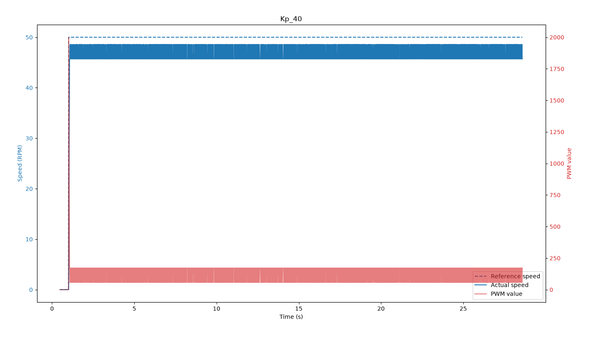
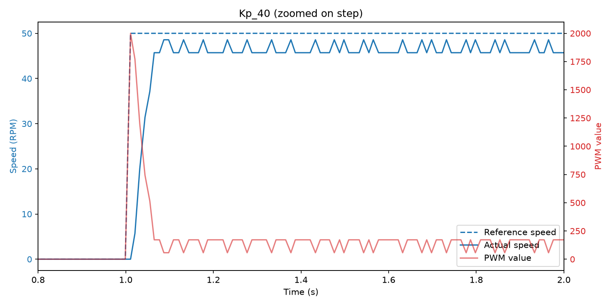
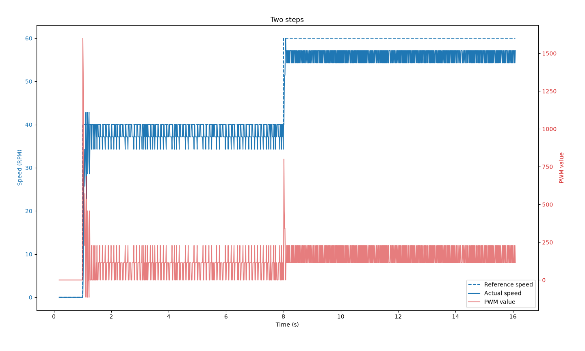
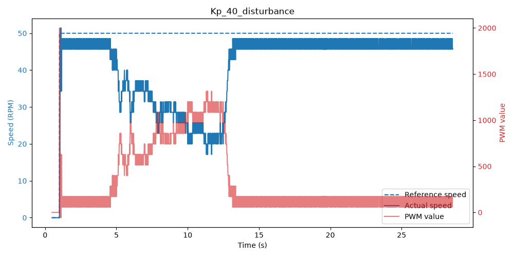

# Project 2 - Results

## Part 1
- The pin-change interrupt on C1 (D4) compares C1 with C2 (D3) and does `pos++` or `pos--` depending on direction, so the position (and therefore the speed) is signed.
- Timer1 runs in CTC mode with a 1ms tick (prescaler 64, OCR1A = 249), this is the stable time base.
- `sample_speed()` is called every tick and computes the speed from the position change over the last 10ms, using a sliding window of the last 10 positions.
- $RPM = \frac{\Delta pos}{10ms \cdot 2100} \cdot 60000$, which gives a resolution of $\frac{60000}{10 \cdot 2100} = 2.86$ RPM.

## Part 2
### Maximum motorspeed = $79.6$ RPM

### Time constant of the motor under operating load:
- Calculated 63% of max speed ==> $79.6*0.63 = 50.1$
- Counted number of interrupts with $period_{ms}=1$ while speed is between $0$ and $50.1$ $=24$ ==> 24ms.

## Part 3
### Minimum required update rate
$f_{update} = 10/\tau = 10/(24*10^{-3}) = 416.7$ Hz

### Timing requirements & resource allocation

**Task 1: Counting encoder pulses**
- At max speed (79.6 RPM), pulses will arrive every $\frac{1}{(79.6/60)*2100} = 359$ microseconds in the worst-case scenario. Each needs to be handled before the next one arrives, otherwise counts are lost.
- A pin-change interrupt (PCINT2) on D4 (C1) handles every pulse regardless of other CPU activity. D3 is read inside the ISR to get the direction from C2.
- It has time to do the handling because inside the interrupt are only a few write/read/compare commands, nothing like a Serial print that takes a lot of time.

**Task 2: Computing speed over a stable time base**
- Since speed = $\frac{\Delta p}{\Delta t}$, $\Delta t$ needs to be constant. Timer1 in CTC mode gives a fixed, hardware-timed interval which is independent of software execution time.
- $16MHz / 64 = 250kHz$ ==> 250 counts per ms, so OCR1A = 249 gives exactly 1ms.
- The Timer1 ISR calls `sample_speed()` every tick. It computes the speed over the last 10ms (sliding window), so we keep the 2.86 RPM resolution of a 10ms window but still get a fresh value every 1ms.

**Task 3: Updating the control output at the required rate**
- Control update should be based on fresh measurements so we call `P_cont.update()` inside the same Timer1 interrupt directly after `sample_speed()`.
- This gives $f_{update} = 1kHz \geq 416.7Hz$.
- Pin D8 (PB0) is connected to AIN1 (`pwm_pin` in code) and outputs the PWM, pin D9 (PB1) is connected to AIN2 (`dir_pin` in code) and sets the direction.

**Task 4: Storing and transmitting the response to the laptop**
- Inside the Timer1 interrupt we store the speed and control output in public data members of the encoder class. `main()` reads them and prints `time_ms,ref_speed,actual_speed,pwm_value` over serial every 10 ticks (10ms), thereby avoiding prints inside interrupts.
- One line is ~25 bytes, so $25 \cdot 100 = 2.5kB/s$, well below the $115200/10 = 11.5kB/s$ of the serial port at 115200 baud.
- Main usb-c cable is used.

**Task 5: Stable PWM output for the motor**
- Timer0 in CTC mode with prescaler 8 ($0.5\mu s$ per tick) and OCR0A = 239 gives a period of $240 \cdot 0.5\mu s = 120\mu s$ ==> $f_{pwm} = 8.33kHz$.
- The COMPA interrupt sets D8 high at the start of each period and COMPB sets it low at OCR0B, so the duty cycle (0-255) is set by OCR0B.
- $f_{pwm}$ is well above $f_{update} = 1kHz$ so every control update is applied over several PWM periods, but not so high that the motor loses max speed.

| Task | Timing requirement | Method | Resources |
|---|---|---|---|
| Counting encoder pulses | Handle each pulse within $359\mu s$ | Pin-change interrupt, `pos++`/`pos--` | PCINT2 (D4), D3 as input |
| Speed over stable time base | Fixed $\Delta t$, fresh value every 1ms | Timer1 ISR, 10ms sliding window | Timer1 CTC, prescaler 64, OCR1A = 249 |
| Control update | $f_{update} \geq 416.7Hz$ (we use 1kHz) | `P_cont.update()` in Timer1 ISR after `sample_speed()` | Timer1 COMPA interrupt |
| Storing and transmitting | Print every 10ms without blocking ISRs | Values stored in ISR, printed from `main()` | USART0 at 115200 baud |
| Stable PWM | $f_{pwm} = 8.33kHz \gg f_{update}$ | Timer0 compare interrupts toggle D8 | Timer0 CTC, prescaler 8, OCR0A = 239, D8, D9 |

### Validation
- Encoder ISR and Timer1 ISR: each ISR records its own worst-case duration by snapshotting TCNT0 (encoder ISR) or TCNT1 (Timer1 ISR) before/after its work, converted to time via the known tick length, then printed once over serial. Must be $< 359\mu s$ and $< 1ms$ respectively.
- Tick period and PWM frequency: Timer0 PWM periods are counted over a 1s window timed by Timer1 (`ms_since_start`), which gives $f_{pwm}$ directly and cross-checks the 1ms tick, since both timers are independent peripherals with different prescalers.
- Serial: check the spacing of the `time_ms` column in the captured CSV.

## Part 4

### P_controller class
Implemented `P_controller(double Kp)` and `double update(double ref, double actual)`, computing `u(t) = Kp*(ref - actual)` and returning it directly each call (not accumulated onto the previous value, per spec).

We use $K_p = 40$ (`P_cont`). `main()` only sets `enc.ref_speed` and reads the values to print, so the application doesn't know about the hardware or the control law.

The reference value, actual value and PWM value are printed every 10ms.

Note: PWM values above 255 in the plots are the raw controller output, the applied duty cycle is clamped to 255 in `Analog_out::set()`.

### Step response
Reference speed stepped from 0 to 50 RPM at 1s. The speed settles at ~46-48 RPM without oscillating, and never reaches 50 RPM because of friction (proportional control needs a nonzero error to keep driving the motor).

Zoomed on the step: the speed rises from 0 to ~46 RPM in ~60ms, no overshoot.

Two steps, 40 RPM at 1s and 60 RPM at 8s. The speed settles at ~37-40 RPM and ~54-57 RPM.

### Change in motor load
Friction applied to the wheel from ~4.5s to ~12.5s. The speed drops to ~20-35 RPM and the PWM value increases to compensate. When the friction is removed the speed returns to ~47 RPM.

### Timing validation results

Measured by having each ISR track its own worst-case duration via TCNT0/TCNT1, printed once over serial, and by counting Timer0 PWM periods over a 1s window timed by Timer1.

| Requirement | Target | Measured |
|---|---|---|
| Encoder ISR duration | $< 359\mu s$ | $3.5\mu s$ |
| Timer1 ISR duration | $< 1ms$ | $196\mu s$ |
| Timer1 tick period | $1ms$ | confirmed by the PWM count below |
| PWM frequency | $8.33kHz$ | $7716Hz$ |
| Serial print interval | $10ms$ | $10ms \pm 1ms$ |

The PWM pin is toggled in software from the Timer0 ISR rather than by a hardware compare pin, so its timing depends on the Timer1 ISR not blocking it for too long. Since the Timer1 ISR (196µs) sometimes runs longer than one PWM period (120µs), a PWM edge is occasionally missed, which is why the measured frequency (7716Hz) is a bit below the calculated 8.33kHz.

### Video
Video: https://youtube.com/shorts/JXJkAuEihqM?feature=share
### Github Repo
Repo: https://github.com/A-Klang/Projects_EmbeddedRU
